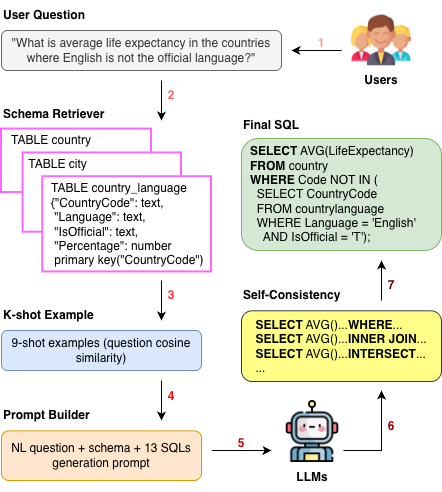

# Text-to-SQL Generation using Large Language Models

This repository contains a **lightweight and modular Text-to-SQL pipeline** for evaluating large language models (LLMs) on the **[Spider 1.0](https://yale-lily.github.io/spider)** and **[BIRD](https://bird-bench.github.io/)** Text-to-SQL benchmarks, using OpenAI-compatible providers. The project implements a **prompt-engineering–based Text-to-SQL system** that translates natural language questions into executable SQL queries over **unseen database schemas**, with evaluation conducted on the first 100 queries on **Spider 1.0 development set (`dev.json`)** and a subset of the **BIRD development set (`dev.json`)**, which features larger schemas and more realistic database values.

The pipeline combines **retrieval-augmented in-context learning** (with similar examples retrieved from `test.json`), **chain-of-thought–style reasoning**, and **execution-based self-consistency** to improve robustness on complex, cross-domain queries. For each input question, semantically similar question–SQL examples are retrieved using sentence embeddings and incorporated into a **schema-aware prompt** that encourages structured reasoning over tables, joins, and conditions. The LLM then generates multiple candidate SQL queries, enabling diverse reasoning paths. All candidates are executed locally against the target database, and the final output is selected via **majority voting over execution results**, filtering out invalid or semantically incorrect queries.

This **retrieval–generation–selection pipeline** improves both exact-match and execution accuracy without supervised fine-tuning and provides a clean, extensible baseline that can be easily expanded with additional prompting strategies, schema formatting techniques, or caching mechanisms.

### System Architecture

The figure below illustrates the overall system architecture of the Text-to-SQL pipeline, highlighting the retrieval-augmented prompting and execution-validated generation process. Given a natural language question, the system retrieves semantically similar question–SQL examples and relevant schema information from the Spider dataset, constructs a schema-aware and reasoning-oriented prompt, and generates multiple candidate SQL queries using a large language model (LLM). The generated queries are then executed locally against the target database, and the final SQL output is selected via majority voting over execution results to ensure robustness and semantic correctness.

<p align="center">
  
</p>

## Repository structure

```
root
├── text2sql/
│   ├── main.py                 # CLI entry point
│   ├── config/                 # Configuration loader and defaults
│   ├── generation/             # SQL generation pipeline
│   │   ├── execution.py        # SQL execution + majority voting helpers
│   │   └── rag_pipeline.py     # Retrieval and SQL candidate generation utilities
│   ├── models/                 # Router definitions
│   │   └── provider/           # Provider-specific router settings (deepseek, chatgpt, openrouter)
│   ├── prompt/                 # Prompt builder utilities (zero-shot + COT)
│   └── util/                   # Dataset loader, SQL cleaner, logging helpers
├── output/                     # Run artifacts
│   ├── log/                    # Log files
│   └── predicted/              # Generated SQL predictions
├── spider_data/                # Spider dataset root (dev.json, tables.json, database/)
├── README.md                   # This file
├── requirements.txt            # Python dependencies
├── evaluation.py               # Official evaluation file from the Spider Github repo
├── process_sql.py              # Official process_sql.py file from the Spider Github repo
└── install.py                  # Once install the package nltk module
```

The Spider dataset should be available locally under `./spider_data/` with the following expected files:

- `dev.json`
- `tables.json`
- `dev_gold.sql`
- `test.json`
- `database/` (directory containing the SQLite databases)
- `evaluate.py` (official Spider evaluation script)

Update `text2sql/config/config.json` if your dataset lives elsewhere.

## Environment setup

Create and activate a Python virtual environment:

```bash
python -m venv text2sql/.venv
.venv\Scripts\activate
```

Install dependencies from the repository root:

```bash
pip install -r requirements.txt
```

Set the appropriate environment variables for your chosen provider (for example `DEEPSEEK_API_KEY`, `OPENROUTER_API_KEY`, or `OPENAI_API_KEY`). A `.env` file placed alongside `text2sql/config/config.json` will also be loaded automatically.

## Running inference

The pipeline is invoked via `text2sql/main.py`. A minimal example that runs the first 20 development examples using the DeepSeek provider is shown below:

```bash
python -m text2sql.main --provider deepseek --model deepseek-chat --num_samples 20 --mode zero_shot --out predicted/deepseek_chat_predicted.sql
```

The resulting file contains one SQL query per line. Paths provided via `--out` are resolved under the `output/` directory unless an absolute path is given.

### Configuration

Default values live in `text2sql/config/config.json` and are loaded via `text2sql.config`:

```json
{
  "dataset_name": "spider",
  "dataset_path": "./data/spider_data/",
  "dev_filename": "dev.json",
  "tables_filename": "tables.json",
  "sql_field": "query",
  "default_provider": "deepseek",
  "default_model": "deepseek-chat",
  "num_sample": 100,
  "max_tokens": 8000,
  "request_delay": 0.0,
  "mode": "zero_shot",
  "db_root": "data/spider_data/database",
  "output_llm": "predicted/deepseek_chat_predicted.json",
  "tables_filename": "tables.json",
  "rag": {
    "num_retrieve": 200,
    "k": 4,
    "n": 5,
    "embedding_model_name": "thenlper/gte-large",
    "retrieval_examples_filename": "test.json"
  }
}
```

`dataset_path` should point to the folder containing `dev.json` and `tables.json`, while `output_llm` controls the default prediction filename (stored under `output/`). Retrieval pulls similar examples from `test.json`/`test_tables.json` while generation iterates through `dev.json`/`tables.json`.

All dataset, model, and RAG parameters are read from this JSON file. Command-line arguments can override selected values at runtime: `--provider`, `--model`, `--num_samples`, `--out`, `--mode`, `--k`, `--n`, and `--num_retrieve`.

## Retrieval-augmented Text-to-SQL (inference-only)

The repository also ships an inference-only, retrieval-augmented pipeline that layers cosine-similarity retrieval, self-consistency, and execution-based majority voting. All retrieval settings live in `text2sql/config/config.json` under the `rag` key. Run the pipeline over the development set directly from the main entry point (questions are read from `dev.json`):

```bash
python -m text2sql.main --provider deepseek --model deepseek-chat  --out predicted/deepseek_chat_k=9_n=13_predicted.sql --mode cot --k 9 --n 13 --num_samples 100 --num_retrieve 2000
```

When `--mode cot` (or `mode` in the config) is set, `text2sql/generation/sql_generator.py` orchestrates the following steps:

1. Load `dev.json`/`tables.json` to obtain questions and schema metadata for retrieval and schema formatting.
2. Call `text2sql/generation/rag_pipeline.py` to embed candidate questions and retrieve the top-`k` examples for each target question.
3. Build a chain-of-thought prompt with `text2sql/prompt/prompt_builder.py`.
4. Generate `n` SQL candidates with the configured provider (DeepSeek, ChatGPT models).
5. Execute candidates and perform majority voting in `text2sql/generation/execution.py` to pick the final SQL string.

The pipeline uses sentence-transformers for embeddings, scikit-learn for cosine similarity, SQLite for execution, and the configured chat provider for generation. Provider/model defaults come from `default_provider` and `default_model`.

## Evaluation

Use `evaluation/spider/evaluation.py` to call the official Spider evaluation script and obtain exact match and execution accuracy metrics:

```bash
python install.py
```

```bash
python evaluation/spider/evaluation.py --gold data/spider_data/dev_gold.sql --pred output/predicted/deepseek_chat_k=9_n=13_predicted.sql --db data/spider_data/database --table data/spider_data/tables.json --etype all
```

The script will create a temporary `.sql` file, run `spider_data/evaluate.py`, and print the reported metrics.

### Working with the BIRD dataset

To run the pipeline on the BIRD dev file, point the configuration to the BIRD assets:

```json
{
  "dataset_name": "bird",
  "dataset_path": "./data/bird/",
  "dev_filename": "dev.json",
  "tables_filename": "dev_tables.json",
  "sql_field": "SQL",
  "db_root": "data/bird/dev_databases",
  "output_llm": "predicted/deepseek_chat_k=9_n=13_bird.json",
  "rag": {
    "retrieval_examples_filename": "train.json"
  }
}
```

- `dataset_path` should point to the folder containing `dev.json`, `dev_tables.json`, and `dev_databases/`.
- The pipeline will automatically emit BIRD-formatted predictions (JSON mapping of IDs to `SQL\\t----- bird -----\\t<db_id>`) when `dataset_name` is set to `bird`.

For generating predictions on BIRD dataset, run the model

```bash
python -m text2sql.main --provider deepseek --model deepseek-chat --out predicted/deepseek_chat_k=9_n=13_bird.json --mode cot --k 9 --n 13 --num_samples 100 --num_retrieve 2000
```

After generating predictions, run the BIRD evaluator:

```bash
python evaluation/bird/evaluation.py --predicted_sql_path output/predicted/deepseek_chat_k=9_n=13_bird.json --ground_truth_path data/bird --data_mode dev --db_root_path data/bird/dev_databases/ --num_cpus 4 --meta_time_out 30.0 --diff_json_path data/bird/dev.json
```

> Note: the evaluator looks for `predict_dev.json` and `dev_gold.sql` under the provided paths, so keep the default filenames or adjust the flags accordingly.

### Results on Spider 1.0 (Dev Set)

| Method | EM (%) | EX (%) |
|--------|--------|--------|
| DeepSeek-Chat (Proposed, k=9, n=13) | 79.0 | 80.0 |
| DeepSeek-Chat (Proposed, k=5, n=7) | 71.0 | 78.0 |
| DeepSeek-Chat (Proposed, k=9, n=7) | 74.0 | 78.0 |
| DeepSeek-Chat (Proposed, k=3, n=5) | 67.0 | 77.0 |
| DeepSeek-reasoner (Proposed, k=2, n=3) | 63.0 | 74.0 |


**Table:** Evaluation results of the proposed retrieval-augmented, execution-validated Text-to-SQL pipeline on the first 100 queries from the Spider 1.0 `dev.json` dataset.

### Results on BIRD (Dev Set)

| Method | EX (%) |
|--------|--------|
| DeepSeek-Chat (Proposed, k=9, n=13) | 21.0 |


**Table:** Evaluation results of the proposed retrieval-augmented, execution-validated Text-to-SQL pipeline on the first 100 queries from the BIRD `dev.json` dataset.
